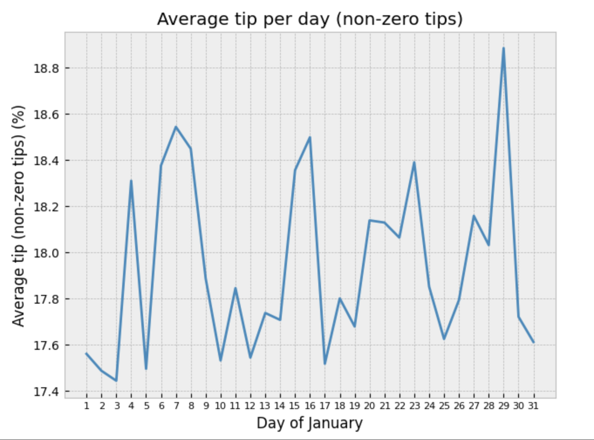

# Project Portfolio

## AI/ML Soccer Analysis System (Python) - [Github Repository](https://github.com/EricHChoi/AI-ML-Soccer-Analysis)

Developed an **AI-driven football analysis system** utilizing YOLO (real-time object detection software), OpenCV, and Python to automate player, referee, and ball detection and tracking in football match videos.

**Technologies/Skills:** Python, YOLO, OpenCV, Video Processing, Object Detection, Model Training, Data Preprocessing

## Predictive Modeling for NYC Uber Tips (SQL, Apache Spark, Python)

Engineered and deployed a **predictive model utilizing Apache Spark and advanced machine learning algorithms** on an 18 million-record dataset of NYC Uber trips to determine the best predictors of riders’ tip percentage. 

  
  

## March Madness Game Outcome Predictor (R) - [Github Repository](https://github.com/EricHChoi/March-Madness-Predictor-Files)
Built a **machine learning classifier** for March Madness games using historical data, achieving **82.4% accuracy** with Random Forest. Employed techniques like Logistic Regression, Decision Trees, and data integration from expert rankings to enhance predictions. 

  
  

**Technologies/Skills:** R, Machine Learning, Random Forest, Logistic Regression, Data Analysis
